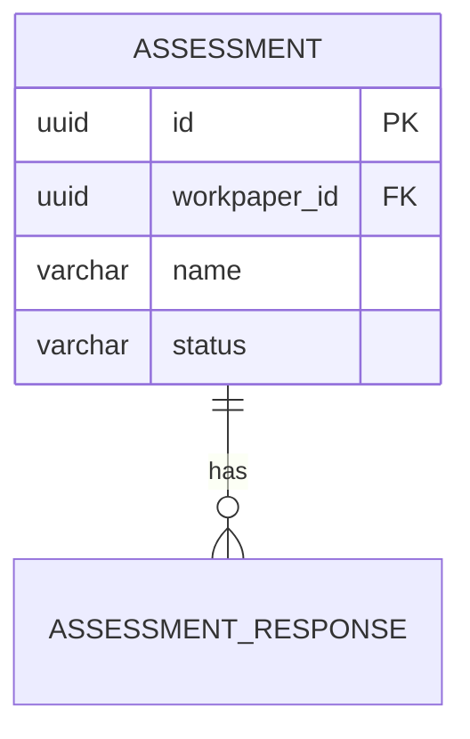

# Area Deep Dive

Deep dive into a specific area of the codebase using parallel `Explore` subagents. Produces a comprehensive reference covering purpose, architecture, data model, key flows, patterns, tests, and dependencies.

## Parameters

| Name | Required | Description |
|------|----------|-------------|
| `area` | Yes | Module name (`assurance-catalog-access`), package path (`com.workiva.grc.access.catalog.internal.service`), directory (`modules/access/assurance-catalog-access`), concept (`custom fields`, `workpaper validation`), or frontend area (`src/assessments`) |

## Repo Paths

| Repo | Language | Path |
|------|----------|------|
| grc-evergreen2 | Kotlin/Spring | `~/workspace/go/src/github.com/Workiva/grc-evergreen2` |
| ts-grc | TypeScript/React | `~/workspace/go/src/github.com/Workiva/ts-grc` |
| grc-evergreen3 | Kotlin | `~/workspace/go/src/github.com/Workiva/grc-evergreen3` |

Determine target repo from the current working directory or from the area identifier if it contains a recognizable repo path.

## Steps

### 1. Locate the Area

Resolve the area identifier to concrete directories:

| Input Type | Resolution |
|------------|------------|
| Module name | `find <repo> -type d -name "<module>"` |
| Package path | Convert dots to slashes, find matching directory |
| Directory | Verify it exists, list contents |
| Concept | Broad `grep -rl` across `.kt`, `.ts`, `.graphqls`, `.sql` to identify core module(s) |

**Constraint:** If the area is too broad (e.g., "the entire access layer"), MUST tell the user and suggest specific modules. List available options.

### 2. Parallel Exploration

Launch 6 `subagent_type: Explore` subagents in parallel:

**Subagent 1 -- File Structure**: List all files, map package structure, identify IPA vs internal, read module README.md if present.

**Subagent 2 -- Public API Surface**: Find IPA interfaces (non-`internal` packages), DTOs, Spring beans, GraphQL schema definitions, exported components/hooks. Read each IPA interface to catalog public method signatures.

**Subagent 3 -- Internal Implementation**: Find service implementations in `*.internal.service.*`, identify key classes and responsibilities, note configuration classes, patterns (factories, builders, visitors, validators).

**Subagent 4 -- Database Schema** (access layer modules): Find related migration files, read latest migrations, map tables/columns/relationships/constraints/indexes. MUST NOT read jOOQ generated code -- reference migrations instead.

**Subagent 5 -- Test Coverage**: Find unit tests (`*Test.kt`), integration tests (`IT*.kt`), scenario tests (`*Scenario.kt` in `api-integration-test`). Note what is well-tested vs gaps.

**Subagent 6 -- Dependencies**: Map outbound imports (what this area uses from other modules) and inbound imports (what other modules use from this area's IPA). Use `grep` on `import` statements.

**Constraint:** Subagents MUST NOT read generated code (jOOQ generated classes, GraphQL codegen output). Reference sources (migrations, schemas) instead because generated code obscures the actual design intent.

### 3. Produce Deep Dive Output

Combine subagent findings into these sections. Adapt depth to area complexity -- a small utility module gets shorter treatment.

**Required sections:**

**Purpose** -- 2-4 sentences: what this area does, what domain it serves, which SDS layer it belongs to and why.

**Architecture** -- Module type (Manager/Engine/Access/Platform), package structure diagram, key classes/interfaces with one-line descriptions.

**Data Model** (if applicable) -- Mermaid ER diagram showing tables with key columns and relationships. Note constraints, indexes, soft delete behavior. For DTOs: list main DTOs with fields and purpose.

**Key Flows** -- Trace the 2-4 most important operations. Each flow: 5-10 numbered steps with file references covering entry point, validation, business logic, persistence, and return/side effects.

**Patterns and Conventions** -- Repository patterns, DTO mapping conventions, validation approach, authorization patterns, testing patterns, area-specific conventions.

**Test Coverage** -- Unit, integration, and scenario test files with what they cover. Explicitly note visible gaps.

**Dependencies** -- Tables for outbound and inbound dependencies:

| Direction | Module | What | Why |
|-----------|--------|------|-----|
| Outbound | platform-core | RequestContext, ValidationGuard | Cross-cutting utilities |
| Inbound | grc-manager | AssessmentAccess interface | Manager orchestrates operations |

**Entry Points** -- IPA interfaces and key methods, GraphQL operations, event handlers, scheduled tasks.

### 4. Offer Obsidian Save

After presenting the deep dive, ask if the user wants it saved. If yes, write to `/Users/alexong/Documents/Obsidian Notes/Obsidian Notes/Vault/Architecture/` with filename: `YYYY-MM-DD-deep-dive-<area-slug>.md`.

## Adaptation by Layer

| Layer | Emphasis |
|-------|----------|
| Access | Data model, repository patterns, migration history, transaction boundaries (detailed DB schema) |
| Manager | GraphQL schema, DataFetcher patterns, authorization directives, orchestration logic (thin data model) |
| Engine | Business logic, orchestration patterns, decision logic (MAY omit data model) |
| Platform | Utility interfaces, configuration, cross-cutting patterns |
| Frontend | Component hierarchy replaces SDS layers; state management replaces database; hook patterns replace repositories |
| Cross-module concept | Deep dive primary module, note connections to secondary modules. MUST NOT try to deep dive everything. |

## Edge Cases

- **Area not found**: Search broadly, suggest closest matches, ask user to clarify.
- **Sparse code**: Produce shorter analysis. MUST NOT pad with filler.
- **Wrong repo**: Note the mismatch, ask user which repo to explore, or try the most likely one.
