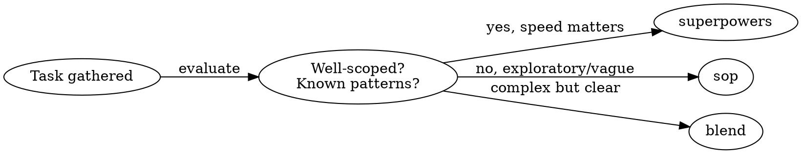

# Build Feature Pipeline

Orchestrate feature development from input to finished branch by invoking the right design, planning, implementation, review, and finish skills in sequence.

## Parameters

- **input** (required): Jira ticket key, Jira URL, or freeform description
- **mode** (optional): `superpowers`, `sop`, or `blend` (default: auto-select after Phase 1)

**Constraints for parameter acquisition:**
- If input is not provided, you MUST ask for it before proceeding.
- If input matches a Jira pattern (`GRC-1234`, `GRCAI-567`, or contains `atlassian.net`), you MUST fetch the ticket via `mcp__atlassian__jira_batch_get_issues` and `mcp__atlassian__jira_get_comments`.
- You MUST NOT prompt for mode unless the user explicitly asks to choose because auto-selection handles this.

## Mode Selection

After gathering context in Phase 1, auto-select a mode unless the user overrode it.



| Signal | Mode |
|--------|------|
| Well-understood, known codebase area, "just build it" | `superpowers` |
| Exploratory, vague requirements, greenfield, unfamiliar area | `sop` |
| Complex AND well-scoped, cross-cutting, clear AC but non-obvious path | `blend` |

Announce the selected mode and rationale in one sentence. The user MAY redirect.

## Phase Map

```
                    superpowers          sop                  blend
                    -----------          ---                  -----
Phase 1: Context    (shared)             (shared)             (shared)
Phase 2: Design     sp-brainstorming     sop-pdd              sop-pdd
Phase 3: Plan       sp-writing-plans     sop-code-task-gen    sp-writing-plans
Phase 4: Implement  sp-subagent-driven   sop-code-assist      sp-subagent-driven
Phase 5: Review     sp-requesting-review sp-requesting-review sp-requesting-review
Phase 6: Finish     sp-finishing-branch  sp-finishing-branch  sp-finishing-branch
```

**Why blend uses PDD for design but Superpowers for execution:** PDD's one-question-at-a-time clarification produces more thorough designs. Superpowers' subagent-driven development with parallel execution and two-stage review produces faster, higher-quality implementation. Blend takes the best of each.

## Execution

For detailed per-phase, per-mode instructions, see [phases.md](phases.md).

**Phase summary:**

1. **Context** -- Gather input, scan codebase, summarize understanding, select mode
2. **Design** -- Invoke the design skill for the selected mode; user approves design
3. **Plan** -- Invoke the planning skill; present task summary; user confirms before implementation
4. **Implement** -- Invoke the implementation skill; runs continuously without pausing between tasks
5. **Review** -- Invoke code review; fix critical/important issues; re-review until clean
6. **Finish** -- Invoke finish skill; user chooses merge/PR/keep/discard

**Checkpoints (MUST pause for user confirmation):**
- End of Phase 1: confirm understanding and mode
- End of Phase 3: confirm plan before implementation
- Design approval is handled within the design skill's own flow

**Continuous execution (MUST NOT pause):**
- Phase 4 runs all tasks without stopping between them because the user already approved the plan
- Phase 5 fixes and re-reviews without user intervention unless blocked

## Edge Cases

**User wants to skip a phase:** Allow it. Pass their description directly as the spec for the next phase.

**Feature is too small:** If the request is clearly a small fix (under ~30 min), say so and suggest describing the fix directly. Offer the full pipeline if they still want it because the overhead is not justified for trivial changes.

**User pauses mid-pipeline:** Note the current phase. The plan persists on disk; they MAY resume later with `/sp-executing-plans` or `/sp-subagent-driven-development`.

**User overrides mode mid-pipeline:** Honor it. Transition to the new mode's skill for remaining phases.

**No git repo:** Design and planning phases still work. Implementation MUST have a repo -- ask where to create one.

## After Completion

1. Summarize what was built: files changed, tests added, key decisions
2. If a Jira ticket was the input, suggest updating the ticket status
3. Suggest `/brag add` and `/session-summary`

## Boundaries

This skill MUST NOT deploy code. Use `/deploy-and-qa` or `/ship-it` separately.
This skill MUST NOT update Jira because unintended side effects are likely.
This skill MUST NOT make architectural decisions without user approval.
